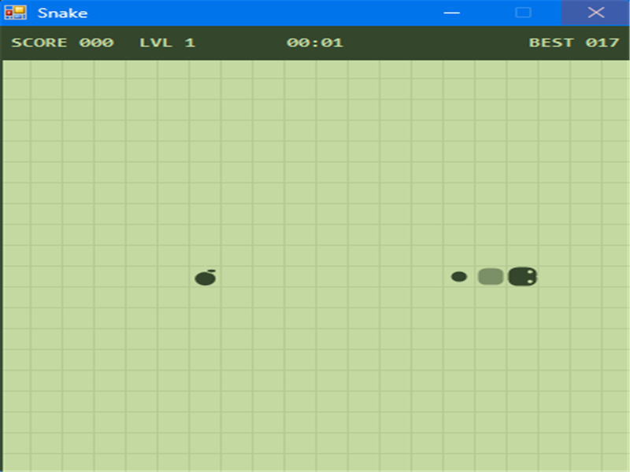

# Snake2000

[](LICENSE)

**Snake2000** — Un remake rétro moderne du classique Snake



Snake2000 rend hommage aux jeux portables des années 2000 avec une esthétique « LCD »
type Nokia 3310, des animations pixelisées et des mécaniques modernes : niveaux progressifs,
bonus/malus, profils avec classement et un mode duel local ou en ligne.

Principales caractéristiques

- **Ambiance rétro** : palette vert pâle, grille pixelisée et sons d'époque.
- **Gameplay évolutif** : la vitesse et la taille du plateau augmentent avec les niveaux.
- **Objets spéciaux** : fruits de vitesse, pièges et effets visuels qui dynamisent la partie.
- **Profils & classement** : sauvegarde locale des meilleurs scores par pseudonyme.
- **Duel** : affrontement local (flèches vs WASD) ou connexion directe TCP pour jouer à deux.

Contrôles

- Déplacer : Flèches ou WASD
- Pause / reprendre : `P`
- Démarrer / Rejouer : `Espace`
- Voir le classement : `L`
- Changer de nom : `N`
- Menu duel/multijoueur : `M`

Compilation et lancement

Deux façons simples d'exécuter le jeu :

- Ouvrir la solution `Snake2000.slnx` dans Visual Studio (Windows) et appuyer sur `F5`.
- Utiliser le CLI .NET depuis la racine du projet :

```powershell
dotnet build Snake2000.slnx
dotnet run --project Snake2000App
```

Remarques : le projet cible `.NET 8.0` avec Windows Forms — exécution possible uniquement
sur un environnement Windows compatible.

Mode duel en ligne

Le duel en ligne utilise une connexion directe (peer-to-peer) via le port TCP `7788`.
Le joueur hébergeant doit transmettre son adresse IP au partenaire (et éventuellement
configurer un transfert de port si nécessaire).

Contribution

Contributions bienvenues ! Ouvrez une issue pour proposer une amélioration ou soumettez
une pull request. Pour une PR :

1. Forkez le dépôt
2. Créez une branche `feature/ma-fonctionnalite`
3. Soumettez une PR décrivant vos changements

Licence

Ce projet est distribué sous la licence indiquée dans le fichier `LICENSE`.

Merci d'avoir regardé — amusez-vous bien !
